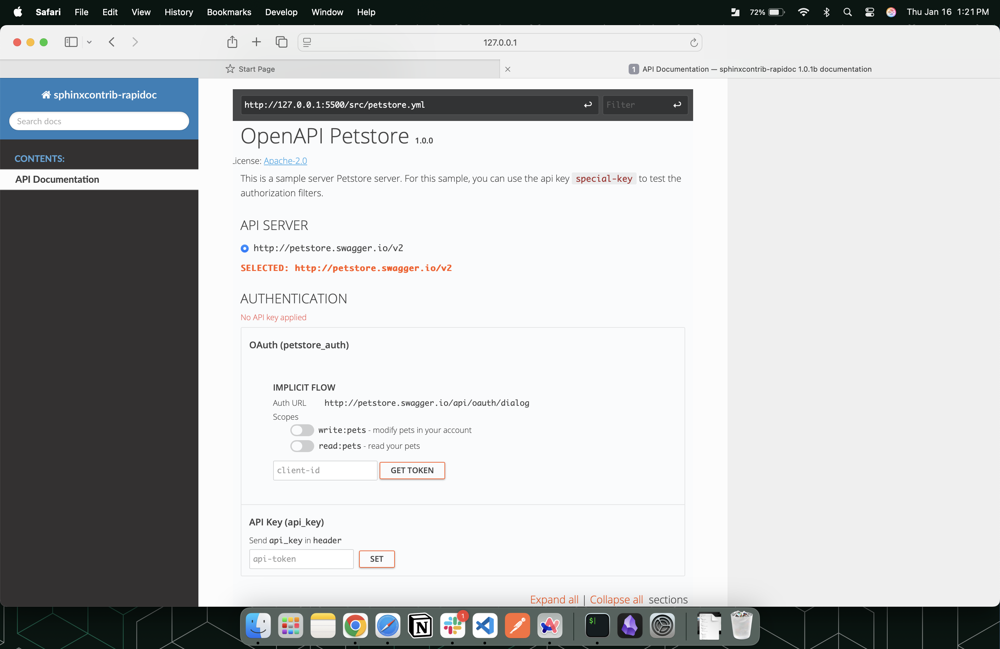
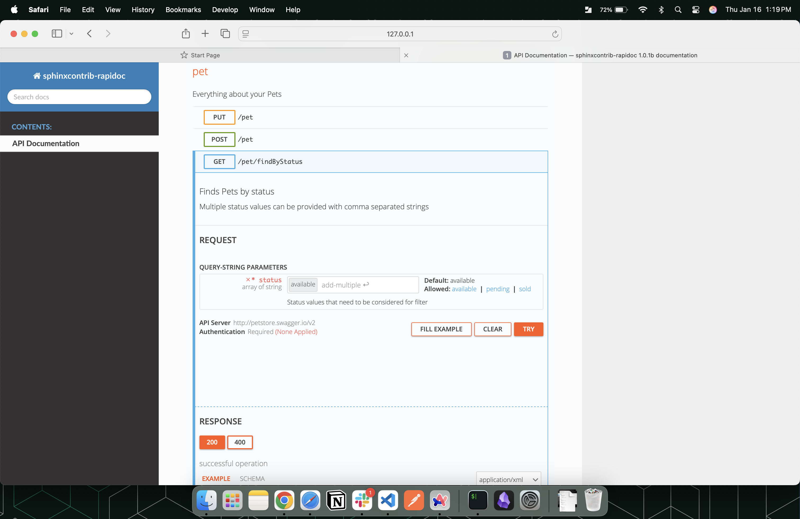

# RapiDoc Integration in Sphinx
RapiDoc powered OpenAPI spec renderer for Sphinx.

## Overview
- RapiDoc is a software module that allows users to build documents with executable RESTful APIs with authentication customization.
- It provides an interface to list all the endpoints and try (execute) them on the go.
- It requires **Swagger (OpenAPI v2.0)** or **OpenAPI (v3.0)** files either in *JSON or YAML* format as its input. Rest, it automatically generates the web interface.


## Steps to generate Interactive RESTful API documentation in Sphinx:
1. Install the python package in your virtual environment by running following command:
`pip install git+https://github.com/TirthS24/sphinx_rapidoc`
2. Include sphinx_rapidoc in extensions in docs/conf.py file.
3. Create a .rst file with with name `<file_name>` having rapidoc directive and with following parameters:
    - `spec-url`: Endpoint of the OpenAPI spec JSON or YAML file. (Do include URL which is accessible from the hosted server to avoid CORS error)
    - `theme`: Appearance of the documentations (light or dark)
    - `render-style`: Either of one: read, view or focused.

    Consider the following code example for creating .rst file:
    ```
    API DOCUMENTATION
    =================

    .. rapidoc::
        :spec-url: http://127.0.0.1:5500/src/petstore.yml
        :theme: light
        :render-style: view
    ```

4. Include `<file_name>` in the index.rst file to navigate through REST API documentation.
5. Run the following command in docs directory: `make html`

## Images

*Endpoint and Authentication sections*


*Sample GET Request*

## Requirements
- Python version **3.9** and above to install all the dependent packages.
- A valid **Swagger** or **OpenAPI** file in JSON or YAML format.